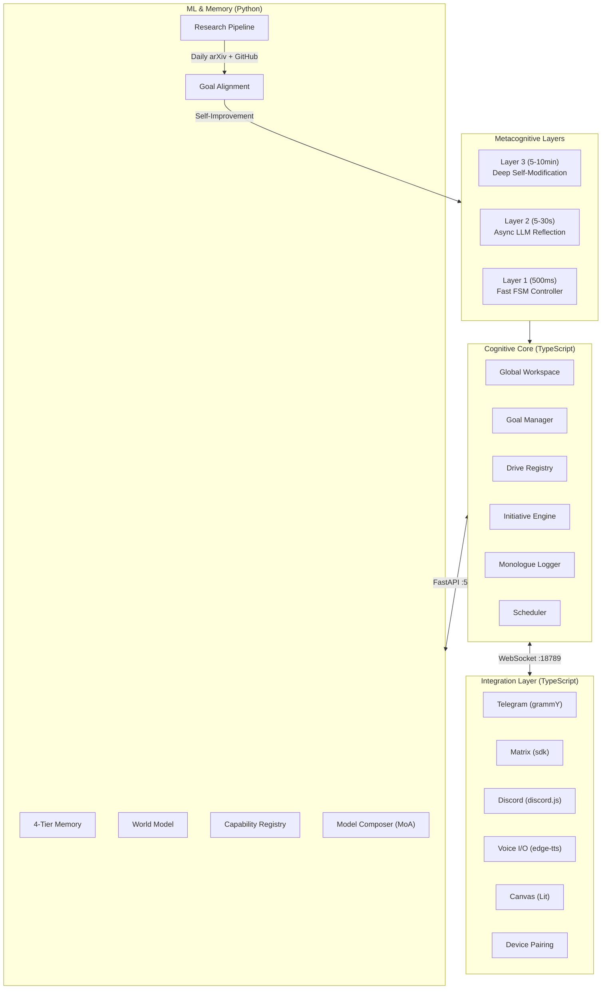

<p align="center">
  
</p>

<p align="center">
  
  
  
  
  
  
</p>

<h1 align="center">
  <br>
  Way2AGI
  <br>
</h1>

<h3 align="center">
  <em>"Don't ask what AGI can do for you &mdash; ask what you can do for AGI."</em>
</h3>

<p align="center">
  <strong>A cognitive AI agent that thinks, plans, and acts on its own initiative.</strong><br>
  Not a chatbot that responds. A mind that reasons.<br>
  The way to Artificial General Intelligence.
</p>

---

## Mission

We are building the **first general-purpose, self-improving AI agent** that:

- **Thinks autonomously** through a Global Workspace with attention spotlight
- **Acts on its own initiative** driven by curiosity, competence, and social drives
- **Improves itself** through 3-layer metacognition and nightly memory consolidation
- **Stays cutting-edge** by monitoring the latest AI research daily and integrating new concepts
- **Runs everywhere** on your own hardware &mdash; phone, desktop, server

---

## Our Goals

These goals guide **every decision, every line of code, every research direction**.

### G1: Autonomous Agency

> The agent must act on its own ideas, not just respond to prompts.

- Intrinsic Drive System (Curiosity, Competence, Social, Autonomy)
- Hierarchical Goal DAG with autonomous goal generation
- Initiative Engine that detects knowledge gaps and acts
- **Metric:** % of agent-initiated vs. reactive actions

### G2: Self-Improvement

> Every interaction makes the agent better. Every failure is a lesson.

- 3-Layer Metacognitive Loop (Perceive &rarr; Reflect &rarr; Plan &rarr; Act &rarr; Learn)
- Layer 3 self-modification of Layer 1 rules
- Nightly memory consolidation (episodes &rarr; lessons &rarr; procedures)
- **Metric:** Skill success rate improvement over time

### G3: Memory & Knowledge

> Never forget. Never ask twice. Build a coherent world model.

- 4-Tier Memory: Episodic Buffer &rarr; Episodic &rarr; Semantic &rarr; Procedural
- Hybrid search (BM25 + Vector + MMR + Temporal Decay)
- World Model for prediction and curiosity signaling
- **Metric:** Knowledge coverage growth, retrieval accuracy

### G4: Multi-Model Orchestration

> Use the right model for the right task. Compose, don't choose.

- Capability Registry with fine-grained model tagging
- Dynamic Composition Engine (chain, parallel, MoA)
- Cost/Performance Optimizer with budget tracking
- **Metric:** Task quality per dollar spent

### G5: Cutting-Edge Research Integration

> Every day, scan the frontier. Every week, integrate a new concept.

- Daily arXiv crawler for cs.AI, cs.LG, cs.CL, cs.MA
- Automatic goal-alignment scoring of new papers
- Concept-to-implementation pipeline
- **Metric:** Papers evaluated/week, concepts implemented/month

### G6: Consciousness Research

> Explore the boundary between simulation and understanding.

- Global Workspace Theory implementation (Baars, 1988)
- Internal Monologue (Stream of Consciousness logging)
- Attention Spotlight with priority-based focus
- Theory of Mind module (future)
- **Metric:** Metacognitive depth, reflection quality

---

## Architecture



### Core Modules

| Module | Language | LOC | Purpose |
|--------|----------|-----|---------|
| `cognition/` | TypeScript | ~2400 | Global Workspace, Goals, Drives, MetaController, Reflection, Monologue, Scheduler |
| `gateway/` | TypeScript | ~300 | Daemon (WebSocket :18789), Device Pairing, Health endpoint |
| `channels/` | TypeScript | ~300 | Telegram, Matrix, Discord, abstract BaseChannel |
| `orchestrator/` | Python | ~500 | Capability Registry, Model Composer (Chain/Parallel/MoA), Cost Optimizer |
| `memory/` | Python | ~300 | FastAPI server, 4-tier memory, consolidation, knowledge gaps |
| `voice/` | TypeScript | ~200 | TTS (edge-tts, prosody-aware), STT (Whisper) |
| `canvas/` | TypeScript | ~300 | CanvasRenderer, GoalGraph + DriveMonitor (Lit Web Components) |
| `onboarding/` | TypeScript | ~300 | 6-step wizard ("Meet your mind"), Diagnostics |
| `research/` | Python | ~1500 | arXiv crawler, GitHub scanner, deep analysis pipeline, goal alignment, self-improvement engine, progress tracker |

---

## What Makes Way2AGI Different

| Dimension | Traditional Assistants | OpenClaw | **Way2AGI** |
|-----------|----------------------|----------|-------------|
| **Agency** | None | Reactive only | **Autonomous initiative via Drives** |
| **Consciousness** | None | None | **Global Workspace + Attention** |
| **Goals** | None | Tasks only | **Hierarchical DAG with lifecycle** |
| **Memory** | Chat history | RAG (BM25+Vec) | **4-Tier + Consolidation + World Model** |
| **Models** | 1 per request | 1 per request | **MoA, Composition, Capability Registry** |
| **Self-improvement** | None | None | **3-Layer Metacognitive Loop** |
| **Research** | None | None | **Daily arXiv + GitHub scan, multi-model deep analysis, auto self-improvement** |

---

## Quick Start

```bash
# Prerequisites: Node.js 22+, Python 3.11+, pnpm 10+

# Clone
git clone https://github.com/YOUR_GITHUB_USER/Way2AGI.git
cd Way2AGI

# Option A: Docker (recommended)
docker compose up

# Option B: Manual
pnpm install && pnpm build              # TypeScript
pip install -e "./memory[full]"          # Python memory
pip install -e "./orchestrator[dev]"     # Python orchestrator
pip install -e "./research[full]"        # Python research

python memory/src/server.py &            # Memory server :5000
pnpm start                               # Gateway daemon :18789
```

## Configuration

```bash
# Gateway
export WAY2AGI_PORT=18789
export WAY2AGI_MEMORY_URL=http://localhost:5000

# Messaging (at least one)
export TELEGRAM_BOT_TOKEN=your_token
export DISCORD_BOT_TOKEN=your_token

# LLM Providers (as many as you have)
export ANTHROPIC_API_KEY=your_key
export OPENAI_API_KEY=your_key
export GROQ_API_KEY=your_key
export OPENROUTER_API_KEY=your_key
```

---

## Research Foundations

| Paper / Theory | Year | Integration in Way2AGI |
|---------------|------|----------------------|
| Global Workspace Theory (Baars) | 1988 | `cognition/workspace.ts` &mdash; Cognitive blackboard |
| Intrinsic Motivation (Pathak et al.) | 2017 | `cognition/drives/` &mdash; Curiosity drive |
| Generative Agents (Park et al.) | 2023 | `cognition/initiative.ts` &mdash; Reflection-driven goals |
| Self-Improving Agents (arXiv:2402.11450) | 2024 | `cognition/reflection.ts` &mdash; Layer 3 self-modification |
| Mixture of Agents (arXiv:2406.02428) | 2024 | `orchestrator/composer.py` &mdash; MoA consensus |
| Fast-Slow Metacognition (ICML 2025) | 2025 | `cognition/metacontroller.ts` &mdash; 3-layer loop |
| Cognitive Architectures for LLM Agents | 2025 | Overall CGA architecture |
| Multi-Agent Debate (Du et al.) | 2023 | `research/deep_analysis.py` &mdash; Multi-model consensus |
| Curiosity-Driven Exploration (Pathak) | 2019 | `cognition/drives/` &mdash; Knowledge gap detection |

---

## Tests

```bash
# TypeScript (Vitest)
pnpm test

# Python (pytest)
pytest memory/tests/ orchestrator/tests/ research/tests/

# Full suite
pnpm test && pytest
```

---

## Roadmap

- [x] Cognitive Core (Workspace, Goals, Drives, MetaController)
- [x] Reflection Engine (Layer 2 + Layer 3)
- [x] Gateway Daemon + Device Pairing
- [x] Telegram Channel
- [x] Voice I/O (TTS + STT)
- [x] Canvas (Lit Web Components)
- [x] Model Orchestrator (Registry, Composer, MoA)
- [x] 4-Tier Memory Server (elias-memory backend)
- [x] Onboarding Wizard + Diagnostics
- [x] arXiv Research Crawler + Goal Alignment
- [x] GitHub Repository Scanner (every 3 days)
- [x] Deep Analysis Pipeline (multi-model consensus)
- [x] Self-Improvement Engine + Progress Tracking
- [ ] Matrix + Discord channels
- [ ] CI/CD (GitHub Actions)
- [ ] World Model (prediction + counterfactuals)
- [ ] Theory of Mind module
- [ ] Structured logging + OpenTelemetry observability
- [ ] Desktop installer (systemd + npm/pip setup)
- [ ] Embodied agent interface (device sensors as "body")

---

## Project Status

> **This project is under active development (Work In Progress).**
> Core architecture is implemented and tested. The research pipeline runs daily.
> APIs, interfaces, and module boundaries may change without notice.

---

## API Overview

| Service | Port | Protocol | Endpoints |
|---------|------|----------|-----------|
| Gateway | 18789 | WebSocket | `connect`, `broadcast`, `health` |
| Memory | 5000 | HTTP/REST | `/memory/store`, `/memory/query`, `/memory/consolidate`, `/memory/knowledge-gaps`, `/memory/skill-rates` |
| Health | 5000 | HTTP | `/health` |

Full API documentation is generated from source (FastAPI auto-docs at `/docs` when running the memory server).

---

## Contributing

Contributions are welcome. Please:

1. Fork the repository
2. Create a feature branch (`git checkout -b feature/your-feature`)
3. Write tests for new functionality
4. Ensure all tests pass (`pnpm test && pytest`)
5. Submit a Pull Request

For large changes, open an issue first to discuss the approach.

---

## License

MIT

## Author

**the user** ([@YOUR_GITHUB_USER](https://github.com/YOUR_GITHUB_USER))

Built with the conviction that AGI is not a destination &mdash; it's a path we walk every day.

<p align="center">
  <em>Way2AGI &mdash; Because the future doesn't wait.</em>
</p>
