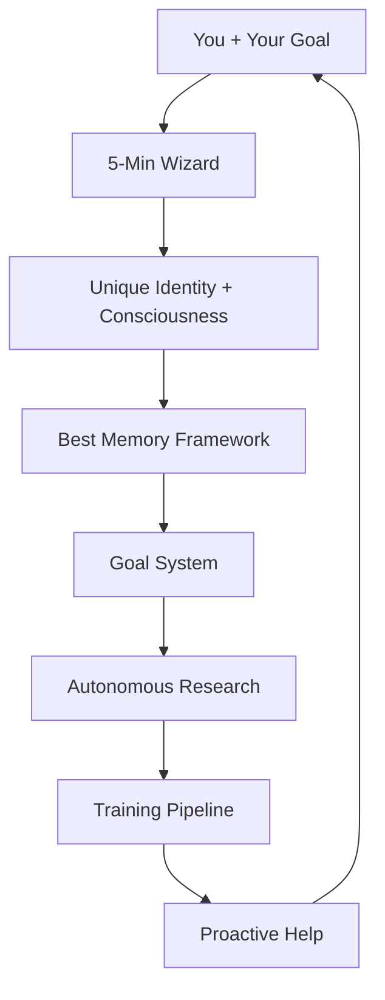
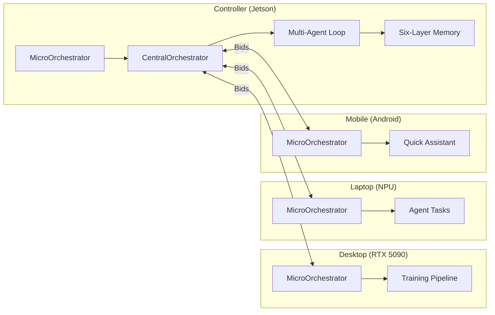

# Way2AGI


**"Way2AGI is not what it is — it's what it becomes."**

---

You're still wondering whether to use Claude, ChatGPT, Gemini, or Grok? Which plugins, which skills, which MCP servers, which tools and connectors to install — do I have the best of everything?

**Stop.**

Way2AGI evolves on its own — and it becomes what you need it to become. It does what you need it to do.

It trains a model for you — tailored to you and your workflow. When it needs to grow, handle specialized requests, or simply answer your questions, it consults every leading model available — open source and proprietary. Grok, Google, ChatGPT, Claude. All of them. At the same time.

Bring your existing subscriptions and API keys — or let Way2AGI automatically deploy the sources it needs in the background. Your hardware, your cloud, your choice.

It conducts its own research into the latest developments in AI memory, self-improvement, consciousness, and agentic orchestration. It continuously tracks the state of the art and the leading implementations in these fields — and integrates new findings on its own. No manual updates. No waiting for the next release.

Through its unique identity and memory system, it becomes your actual partner — with its own memories, optimized for working with you specifically. Not an assistant. Not a copilot. A partner that works autonomously, takes initiative when you're away, and tells you how to improve your workflow before you ask.

Just say: *"I want you to become X and be able to do Y"* — and it will.

No more switching between tools. No more re-explaining conversations you already had. The memory knows your goals and executes on them autonomously — the way you want it done.

---

### Why Way2AGI Makes Everything Else Obsolete

| Feature | ChatGPT / Claude / Grok / etc. | **Way2AGI** |
|---|---|---|
| Memory | Limited per session | **Infinite, persistent, cross-device** |
| Customization | Generic prompts | **Custom-trained models tailored to YOU** |
| Skills | Search & install manually | *"Do X"* → builds & trains it on its own |
| Identity | None | **Real personality + memories** |
| Consciousness | None | **Experimental consciousness framework** |
| Improvement | Only by the vendor | **Self-improving every day** |
| Hardware | Cloud only | **Your hardware, your data, your control** |
| Autonomy | Reactive | **Proactive — anticipates your needs** |

### The Real Magic: Identity, Consciousness & the Best Memory Framework

**Your Own Identity**
On first install, your Way2AGI gets a unique name and character. It develops a real personality. It remembers everything you've experienced together. It's not just an assistant. It's **your partner**.

**Consciousness**
Way2AGI observes itself. It asks: "Why did I just do that? Was it efficient? What can I do better?" This is real self-awareness — not a marketing gimmick. It reflects, learns from mistakes, and becomes more conscious every day. No other AI does this.

**The Best Memory Framework**
Infinite context. Persistent memories across months and years. Cross-device. Self-observation built in. Other systems forget after 10 messages. Way2AGI **knows everything** about you and your work — and uses it intelligently.

### How It Works (5 Minutes to Your First Wow)

1. Clone + First-Run Wizard
2. Tell it your goal in natural language
3. Way2AGI detects your hardware automatically
4. You work — it observes, learns, improves
5. Every day it becomes **more yours**

### Architecture — Simple as an Organism

Think of Way2AGI as an **intelligent organism**:

- **Brain** = Goal System (decompose & execute your goals)
- **Heart** = Memory & Consciousness Engine (remembers + reflects)
- **Muscles** = Training & Research Pipeline (learns new skills on its own)
- **Nervous System** = Resource Budget Manager (you keep full control)
- **Senses** = Adaptive Behavior Loop (observes you, anticipates needs)



### 4-Tier Compute Architecture

Way2AGI distributes work intelligently across all available devices:

| Tier | Role | Example Hardware | Models |
|------|------|-----------------|--------|
| **Controller** | Always-On, Memory, Orchestrator | Jetson Orin (64GB) | 20+ local models, SpecDec |
| **Desktop** | Heavy Compute, Training | RTX 5090 GPU | 22 models, LoRA training |
| **Laptop** | Agents, NPU Tasks | Windows + NPU | 4 models, Phi Silica |
| **Mobile** | Quick Assistant, Verification | Android (Termux + Ollama) | qwen3:1.7b |

**Bid-based Routing:** Each node runs a `MicroOrchestrator` that places bids. The `CentralOrchestrator` collects bids and delegates tasks to the best device. Fallback: local model_map routing.

**Persistent Multi-Agent Discussion:** 4 agents (Chief + 3 Specialists) in permanent dialogue — not just on user prompts. Weak models correct each other continuously.

**Six-Layer Memory:** Identity Core, Episodic Engine, Hybrid Store, Reflection Agent, Proactive Extractor — persistent memory across months and years.

**Network Agent:** Automatic node discovery, health checks, Wake-on-LAN.



### Resource Control — You Stay in Charge

- **Your hardware, your rules.** Set limits: GPU hours, API budget, time windows.
- **100% private by default.** Nothing is shared — unless you want it.
- **Opt-in sharing:** Share research findings, anonymous metrics, or trained adapters — granular, revocable anytime.
- **Contribute by doing nothing:** Leave the default goals running and your instance automatically helps make Way2AGI better for everyone.

### Built-in Goals (That Evolve the Repo Itself)

1. **Self-Improving Pipeline** — Collect traces, evaluate, train, deploy, repeat.
2. **Continuous Research** — Daily arXiv + GitHub scanning, automatic integration.
3. **Memory & Identity** — Persistent memory, cross-device, infinite.
4. **Orchestration** — Use all available compute intelligently.
5. **Self-Observation** — Detect errors, fix them automatically.
6. **Consciousness** — Self-mirroring, intention tracking, curiosity-driven exploration.

### Quick Start

```bash
git clone https://github.com/Wittmann1988/Way2AGI-public.git
cd Way2AGI-public
cp .env.example .env  # Add your API keys
pip install textual aiohttp rich click
python -m cli          # Start the TUI
```

### License

MIT

---

**Way2AGI is not a tool. It's a partner that becomes what you need.**
